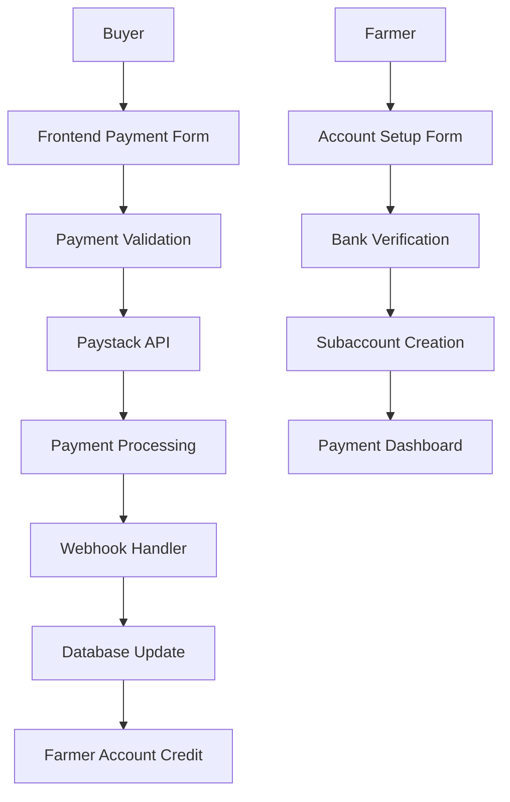

# AgriConnect Paystack Integration Guide

## Overview

This guide documents the comprehensive Paystack integration implemented in AgriConnect, enabling farmers to set up payment accounts to receive payments and allowing buyers to make payments through the platform.

## Architecture Overview



## Key Features Implemented

### 1. Farmer Payment Account Setup
- **Bank Account Verification**: Real-time verification with Paystack API
- **Subaccount Creation**: Automatic creation of Paystack subaccounts for split payments
- **Document Verification**: Support for business registration and identity documents
- **Dynamic Form Validation**: Real-time validation with progress tracking

### 2. Buyer Payment Integration
- **Paystack Popup Integration**: Secure payment processing with Paystack's iframe
- **Multiple Payment Methods**: Support for cards, bank transfers, and mobile money
- **Split Payment**: Automatic distribution between farmer and platform
- **Payment Verification**: Server-side verification for security

### 3. Dynamic State Management
- **Real-time Validation**: Form fields validate as users type
- **Progress Tracking**: Visual indicators show completion status
- **Button State Management**: Buttons dynamically enable/disable based on form validity
- **Error Handling**: Comprehensive error display with actionable suggestions

## Implementation Structure

### Backend Components

#### 1. Paystack Service (`backend/src/services/paystack.service.js`)
```javascript
// Core Paystack operations
- createFarmerSubaccount()
- verifyBankAccount()
- initializePayment()
- verifyPayment()
- processRefund()
- getBanks()
```

#### 2. Payment Controller (`backend/src/controllers/payment.controller.js`)
```javascript
// API endpoints
- GET /api/payments/banks
- POST /api/payments/verify-bank-account
- POST /api/payments/farmer/setup-account
- GET /api/payments/farmer/account
- POST /api/payments/initialize
- GET /api/payments/verify/:reference
- POST /api/payments/webhook
- POST /api/payments/refund
```

#### 3. Payment Models (`backend/src/models/payment.model.js`)
```javascript
// Database schemas
- FarmerPaymentAccount
- PaymentTransaction
- Refund
- PaymentLink
```

#### 4. Validation Middleware (`backend/src/middleware/validation.middleware.js`)
```javascript
// Validation rules
- validateBankAccount
- validateFarmerPaymentSetup
- validatePaymentInitialization
- validateRefundRequest
```

### Frontend Components

#### 1. Payment Context (`frontend/src/context/PaymentContext.js`)
```javascript
// Global payment state management
- setupFarmerPaymentAccount()
- verifyBankAccount()
- initializePayment()
- verifyPayment()
- loadPaymentTransactions()
```

#### 2. Farmer Components
- **PaymentSetup**: Bank account setup and verification
- **PaymentDashboard**: Transaction history and earnings tracking
- **FarmerRegistration**: Enhanced with payment setup step

#### 3. Buyer Components
- **BuyerPayment**: Paystack popup integration with validation
- **Payment Validation**: Real-time form validation utilities

#### 4. Validation Utilities (`frontend/src/utils/paymentValidation.js`)
```javascript
// Comprehensive validation functions
- validateEmail()
- validatePhoneNumber()
- validateBankAccount()
- validateAmount()
- validateBusinessName()
- getButtonState()
```

## Environment Configuration

### Backend Environment Variables
```bash
# Paystack Configuration
PAYSTACK_SECRET_KEY=sk_test_your_secret_key_here
PAYSTACK_PUBLIC_KEY=pk_test_6134da91ac4299dd1b3e12340329c5fbb6794acc

# Database
MONGODB_URI=your_mongodb_connection_string

# JWT
JWT_SECRET=your_jwt_secret
JWT_REFRESH_SECRET=your_jwt_refresh_secret

# Email (for notifications)
EMAIL_SERVICE=gmail
EMAIL_USERNAME=your_email
EMAIL_PASSWORD=your_app_password

# Frontend URL (for webhooks)
FRONTEND_URL=http://localhost:3000
```

### Frontend Environment Variables
```bash
# API Configuration
REACT_APP_API_URL=http://localhost:5001/api
REACT_APP_FRONTEND_URL=http://localhost:3000

# Paystack
REACT_APP_PAYSTACK_PUBLIC_KEY=pk_test_6134da91ac4299dd1b3e12340329c5fbb6794acc

# Environment
REACT_APP_ENV=development
```

## Security Implementation

### 1. API Security
- **Authentication**: JWT-based authentication for all protected endpoints
- **Rate Limiting**: Configurable rate limits for payment operations
- **Input Validation**: Comprehensive server-side validation
- **Webhook Verification**: HMAC signature verification for Paystack webhooks

### 2. Frontend Security
- **Token Management**: Secure storage and automatic refresh of JWT tokens
- **HTTPS Enforcement**: All payment operations require HTTPS in production
- **XSS Protection**: Input sanitization and output encoding
- **CSRF Protection**: Token-based request verification

### 3. Payment Security
- **PCI Compliance**: No card data stored on servers (handled by Paystack)
- **Webhook Validation**: Cryptographic verification of webhook payloads
- **Transaction Logging**: Comprehensive audit trail for all transactions
- **Refund Protection**: Admin-controlled refund processing

## Form Validation Features

### Real-time Validation
```javascript
// Example: Email validation with suggestions
const emailValidation = validateEmail('user@gmai');
// Returns: {
//   isValid: false,
//   error: 'Please enter a valid email address',
//   suggestions: ['user@gmail.com']
// }
```

### Dynamic Button States
```javascript
// Buttons automatically update based on form validity
const buttonState = getButtonState(validationResult, isLoading);
// Returns: {
//   disabled: true/false,
//   text: 'Complete 2 fields to continue',
//   className: 'bg-gray-300 text-gray-500 cursor-not-allowed',
//   showSpinner: false
// }
```

### Progress Tracking
- Visual progress bars show completion percentage
- Step-by-step completion indicators
- Real-time validation feedback with icons

## Payment Flow

### Farmer Onboarding Flow
1. **Registration**: Enhanced farmer registration with 5 steps
2. **Account Setup**: Business information and bank details
3. **Bank Verification**: Real-time account verification
4. **Subaccount Creation**: Automatic Paystack subaccount setup
5. **Verification**: Admin review and approval process

### Buyer Payment Flow
1. **Order Creation**: Buyer selects products and quantities
2. **Payment Initialization**: System creates payment reference
3. **Paystack Popup**: Secure payment form with multiple options
4. **Payment Processing**: Real-time payment verification
5. **Split Distribution**: Automatic distribution to farmer and platform
6. **Confirmation**: Payment confirmation and receipt generation

### Webhook Processing
1. **Signature Verification**: Validate webhook authenticity
2. **Event Processing**: Handle different webhook events
3. **Database Updates**: Update transaction status
4. **Notifications**: Send email notifications to relevant parties

## Error Handling

### Comprehensive Error Management
- **Network Errors**: Automatic retry mechanisms with exponential backoff
- **Validation Errors**: User-friendly error messages with suggestions
- **Payment Errors**: Detailed error codes and resolution steps
- **System Errors**: Graceful degradation with fallback options

### Error Display Examples
```javascript
// Validation error with suggestions
{
  isValid: false,
  error: 'Phone number must start with 0 and be 10 digits',
  suggestions: ['Format: 0XXXXXXXXX']
}

// Payment error with actions
{
  success: false,
  error: 'Insufficient funds',
  actions: ['Try another card', 'Use bank transfer', 'Contact bank']
}
```

## Testing Strategy

### Test Scenarios
1. **Form Validation Testing**
   - Valid and invalid input combinations
   - Edge cases and boundary conditions
   - Real-time validation behavior

2. **Payment Flow Testing**
   - Successful payment scenarios
   - Failed payment handling
   - Network interruption scenarios
   - Webhook delivery failures

3. **Security Testing**
   - Authentication bypass attempts
   - Input injection testing
   - Webhook spoofing attempts
   - Rate limiting validation

### Test Data
```javascript
// Test bank accounts (Paystack test environment)
const testBankAccounts = {
  successful: '0123456789',
  failed: '0000000000',
  insufficient: '0000000001'
};

// Test card numbers
const testCards = {
  successful: '5555555555554444',
  declined: '5555555555554441',
  insufficient: '5555555555554442'
};
```

## Production Deployment

### Environment Setup
1. **Environment Variables**: Update all keys to production values
2. **SSL Certificates**: Ensure HTTPS is properly configured
3. **Webhook URLs**: Update webhook endpoints to production URLs
4. **Database**: Configure production MongoDB instance
5. **Monitoring**: Set up logging and monitoring systems

### Security Checklist
- [ ] All API keys are production keys
- [ ] HTTPS is enforced for all endpoints
- [ ] Webhook signature verification is enabled
- [ ] Rate limiting is properly configured
- [ ] Audit logging is enabled
- [ ] Error messages don't expose sensitive information

### Performance Optimization
- [ ] Database indexes are properly configured
- [ ] API response caching where appropriate
- [ ] Frontend bundle optimization
- [ ] CDN configuration for static assets
- [ ] Database connection pooling

## Monitoring and Analytics

### Key Metrics to Track
1. **Payment Success Rate**: Percentage of successful payments
2. **Average Transaction Value**: Mean payment amount
3. **Payment Method Distribution**: Breakdown by payment type
4. **Geographic Distribution**: Payments by region
5. **Error Rates**: Frequency of different error types

### Logging Strategy
```javascript
// Transaction logging example
{
  timestamp: '2024-01-15T10:30:00Z',
  event: 'payment_initialized',
  reference: 'AGC_1642248600_ABC123',
  amount: 150.00,
  farmerId: 'farmer_123',
  buyerId: 'buyer_456',
  metadata: { /* additional context */ }
}
```

## Support and Troubleshooting

### Common Issues and Solutions

1. **Payment Fails with "Invalid Reference"**
   - Check reference format (AGC_timestamp_randomhex)
   - Verify transaction exists in database
   - Ensure proper webhook handling

2. **Bank Account Verification Fails**
   - Verify account number format (10 digits)
   - Check bank code accuracy
   - Ensure account is active

3. **Webhook Not Received**
   - Verify webhook URL accessibility
   - Check webhook signature verification
   - Review server logs for processing errors

### Support Contact Information
- **Technical Support**: tech@agriconnect.com
- **Payment Issues**: payments@agriconnect.com
- **Emergency Contact**: +233-XXX-XXXXXX

## API Reference

### Authentication
All protected endpoints require JWT authentication:
```
Authorization: Bearer <jwt_token>
```

### Core Endpoints

#### Get Supported Banks
```http
GET /api/payments/banks
```

#### Verify Bank Account
```http
POST /api/payments/verify-bank-account
Content-Type: application/json

{
  "accountNumber": "0123456789",
  "bankCode": "058"
}
```

#### Setup Farmer Payment Account
```http
POST /api/payments/farmer/setup-account
Authorization: Bearer <jwt_token>
Content-Type: application/json

{
  "businessName": "John's Farm",
  "bankAccount": {
    "bankName": "GTBank",
    "bankCode": "058",
    "accountNumber": "0123456789",
    "accountName": "John Doe"
  },
  "percentageCharge": 10
}
```

#### Initialize Payment
```http
POST /api/payments/initialize
Authorization: Bearer <jwt_token>
Content-Type: application/json

{
  "amount": 150.00,
  "farmerId": "farmer_123",
  "orderId": "order_456",
  "metadata": {
    "description": "Agricultural products purchase"
  }
}
```

### Response Formats

#### Success Response
```json
{
  "success": true,
  "message": "Operation completed successfully",
  "data": { /* response data */ }
}
```

#### Error Response
```json
{
  "success": false,
  "message": "Error description",
  "errors": [
    {
      "field": "email",
      "message": "Invalid email format"
    }
  ]
}
```

## Conclusion

This Paystack integration provides a comprehensive, secure, and user-friendly payment solution for the AgriConnect platform. It handles the complete payment lifecycle from farmer onboarding to payment processing and verification, with robust error handling and security measures throughout.

The implementation prioritizes user experience with real-time validation, dynamic state management, and clear progress indicators, while maintaining security and compliance with payment industry standards.

For questions or support, please refer to the troubleshooting section or contact the development team. 